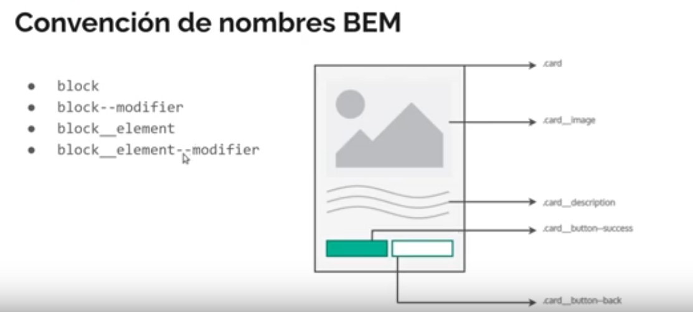

# TP-WorldCapp

desarrolladores:
- Sol Lopez
- Pablo Foglia
- Alejo Menini
- Facundo Barneche
- Juan Caceffo

## Buenas practicas

- Todo el codigo en ingles
- Clases: Convención BEM

- Manejo de tareas con issues
- Mobile first design
- Reutilizacion de componentes y de variables
- Medidas (dentro de lo posible): REM, EM , VW, VH

## Estructura de directorios
- **src**: Directorio Raíz del proyecto
  - **main page**: Página principal
    **Readme.md**: Descrición del proyecto
  - **styles**: Archivo de estilos globales
  - **pages**: Directorio para las páginas individuales y sus estilos
  - **components**: Directorio de componentes y sus estilos reutilizables (cards, menus, etc)
    - **commons**: Directorio de componentes comunes y sus estilos ( botones, checkbox, etc)
  - **images**: Imagenes a usar en la web
    - **tipos de imagen**: Para separar por categoria ( si fuese necesario )
  - **data**: Json o archivos de datos ( futuro )

